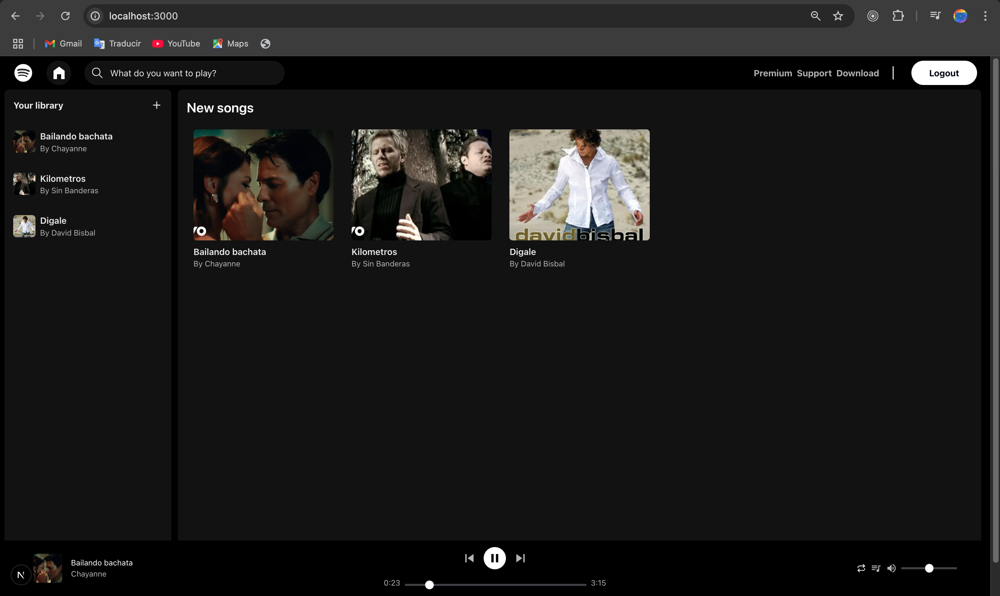

##  Spotify Clone

> This page is a music streamming service app like spotify.



## Built With

- JSX
- TypeScript
- Next.Js
- Supabase
- Tailwind
- React Icons

## Live Demo

[Live Demo](https://spotify-clone-indol-ten.vercel.app/)


## Getting Started

To get a local copy up and running follow these simple example steps.

- Go to the main page of te repo.
- Press the ```Code``` button and get the repo link.
- Clone it using git.

## Authors

**Cecilia Benitez**

- [@Ceci007](https://github.com/Ceci007)


## Contributing

Contributions, issues and feature requests are welcome!

Feel free to check the [issues page](https://github.com/Ceci007/spotify-clone/issues).

## License

This project is [MIT](lic.url) licensed.
